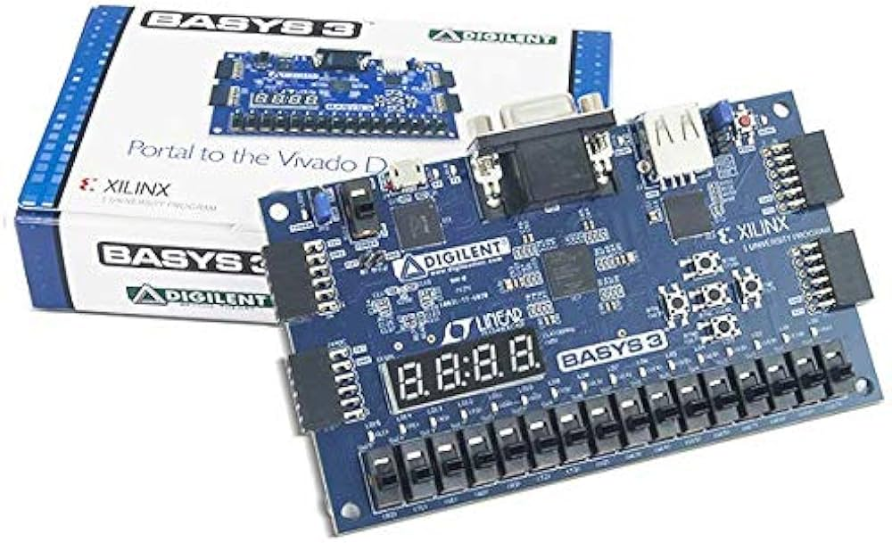
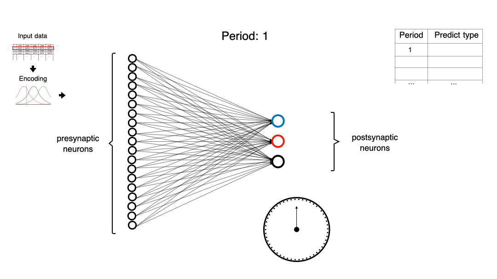
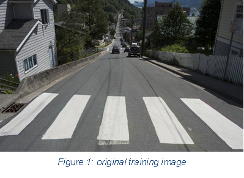
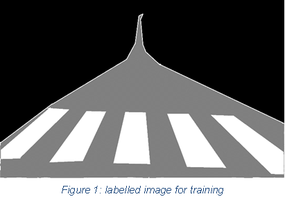
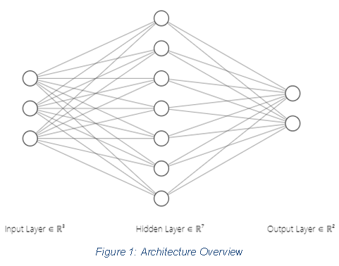
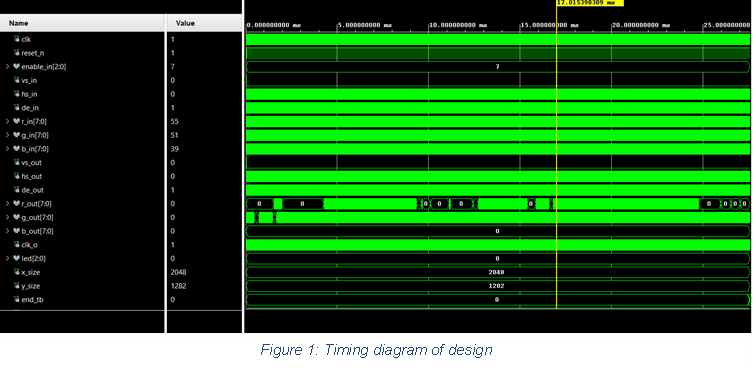
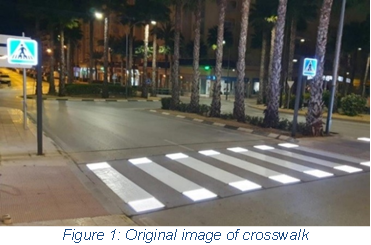
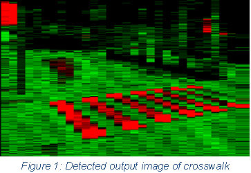

# Spiking Neural Network on FPGA


*Figure 1: Basys3*
## Description

Our project involves implementing a Spiking Neural Network (SNN) on an FPGA for real-time image processing using VHDL. The SNN mimics the spiking behavior of biological neurons, addressing the demand for efficient and low-power neural network solutions in embedded systems. Designed with VHDL to leverage FPGA parallelism, our model undergoes a crucial training phase in Python for weight calculation and data normalization, enhancing its ability to discern visual features.

The FPGA acts as a hardware accelerator for image processing, and the SNN is optimized for color detection, specifically distinguishing between crosswalk and road areas. Real-time observation and behavioral analysis offer insights into system accuracy. Performance metrics, including accuracy and latency, evaluate the efficiency of the SNN on FPGA.


*Figure 2: Source - Medium* (https://medium.com/@tapwi93/first-steps-in-spiking-neural-networks-da3c82f538ad)

## Directory Structure
```
Spiking-Neural-Network-on-FPGA/
|-- SNN-RGB/
|-- Sources/
|   |-- images/
|   |-- Octave/
    |-- Py Scripts/
    |-- Schematic/
|-- README.md
```

## Methodology
The system architecture includes an input layer for processing RGB values, a hidden layer with seven neurons, and an output layer designed for white color detection. Octave was initially employed for neural network training, generating weights used in VHDL design through Vivado. Python facilitated weight normalization for consistency. Real-world image integration utilized the PPM format, translating RGB values seamlessly into the VHDL system's 8-bit representation. Vivado implementation involved a structured input delivery, producing an output after 64 cycles and resulting in a block-like structure in the detected image. Rigorous testing, using a test image, validated the system's performance, assessing its accuracy in detecting white color and confirming its robustness in real-world scenarios.
> PPM, which stands for Portable Pixel Map, is a widely used image file format that stores images in a simple, human-readable, and portable manner. It is a part of the Netpbm graphics toolkit and is supported by various image processing and editing tools.

| Training Image | Labelled Image |
| --------------- | ----------------- |
|  |  |

## Overall Design
We developed several modules, including control, gen_input, and neuron, integrated into the top module named snn_rgb. The overall architecture, depicted in the diagram, involves three major inputs (R, G, B), seven hidden nodes, and two output nodes. This neural network processes RGB inputs and ensures effective communication between modules. Testing and validation have been conducted to optimize functionality, with a focus on refining the architecture for desired project performance.



## Simulation Results



| Test Image | Output Image |
| --------------- | ----------------- |
|  |  |

By observing the detected output image, the road and similar darken colored one are detected as green and the white crosswalk is detected as red. And some other parts of the image are red due to their similarity with the white color. There is a block like structure due to the cycle issue mentioned earlier.

## Future prospects
We need to do some research on how to resolve the issue and find some alternative ways. We just detected the colors only for detection of crosswalk. As an immediate next step, we can use video frames with high-speed detection and use the same technique to alert the drivers in the event of traffic light color changes. 

## References
1. https://github.com/antimattercorrade/Color_Detection_BASYS3
2.	https://github.com/Marco-Winzker/Spiking_NN_RGB_FPGA
3.	https://www.fpga4student.com/2016/11/two-ways-to-load-text-file-to-fpga-or.html
